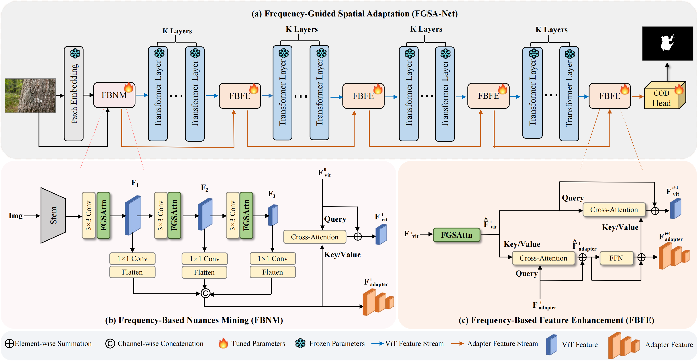

# Frequency-Guided Spatial Adaptation for Camouflaged Object Detection

Created by Shizhou Zhang, Dexuan Kong, Yinghui Xing, Yue Lu,
        Lingyan Ran,
        Guoqiang Liang,
        Hexu Wang, and Yanning Zhang.

This official repository contains the source code of FGSA-Net. (accepted by TMM 2025).

Camouflaged object detection (COD) aims to segment camouflaged objects which exhibit very similar patterns with the surrounding environment. 
Recent research works have shown that enhancing the feature representation via the frequency information can greatly alleviate the ambiguity problem between the foreground objects and the background.
With the emergence of vision foundation models, like InternImage, Segment Anything Model etc, adapting the pretrained model on COD tasks with a lightweight adapter module shows a novel and promising research direction. 
Existing adapter modules mainly care about the feature adaptation in the spatial domain. 
In this paper, we propose a novel frequency-guided spatial adaptation method for COD task. 
Specifically, we transform the input features of the adapter into frequency domain. 
By grouping and interacting with frequency components located within non overlapping circles in the spectrogram, different frequency components are dynamically enhanced or weakened, making the intensity of image details and contour features adaptively adjusted. 
At the same time, the features that are conducive to distinguishing object and background are highlighted, indirectly implying the position and shape of camouflaged object. 
We conduct extensive experiments on four widely adopted benchmark datasets and the proposed method outperforms 26 state-of-the-art methods with large margins.



Our code is based on mmsegmentation.

<!-- [[Project Page]](https://denseclip.ivg-research.xyz/)  -->
[[paper]](https://xplorestaging.ieee.org/document/10844993)

## Usage

### Requirements

- torch>=1.8.0
- torchvision
- timm
- mmcv-full==1.3.17
- mmsegmentation==0.19.0
- mmdet==2.17.0
- regex
- ftfy
- fvcore
- tqdm==4.62.3
- pysodmetrics==1.3.0
- imageio==2.9.0

To use our code, please first install the `mmcv-full` and `mmseg` following the official guidelines ([`mmseg`](https://github.com/open-mmlab/mmsegmentation/blob/master/docs/get_started.md)) and prepare the datasets accordingly. 

### Pre-trained Uni-Perceiver Models

Download the pre-trained Uni-Perceiver models ([repo](https://github.com/fundamentalvision/Uni-Perceiver)                                              | [paper](https://openaccess.thecvf.com/content/CVPR2022/papers/Zhu_Uni-Perceiver_Pre-Training_Unified_Architecture_for_Generic_Perception_for_Zero-Shot_and_CVPR_2022_paper.pdf)) and save it to the `pretrained` folder.


### Training & Evaluation

To train the FGSA-Net model, run:

```
bash dist_train.sh configs/COD/fgsa_net_512.py 1
```

To evaluate the performance of FGSA-Net, run:

```
bash dist_test.sh configs/COD/fgsa_net_512.py /path/to/checkpoint 1
```


## Citation
If you find our work useful in your research, please consider citing:
```
@ARTICLE{10844993,
  author={Zhang, Shizhou and Kong, Dexuan and Xing, Yinghui and Lu, Yue and Ran, Lingyan and Liang, Guoqiang and Wang, Hexu and Zhang, Yanning},
  journal={IEEE Transactions on Multimedia}, 
  title={Frequency-Guided Spatial Adaptation for Camouflaged Object Detection}, 
  year={2025},
  volume={27},
  pages={72-83},
  doi={10.1109/TMM.2024.3521681}}
```
